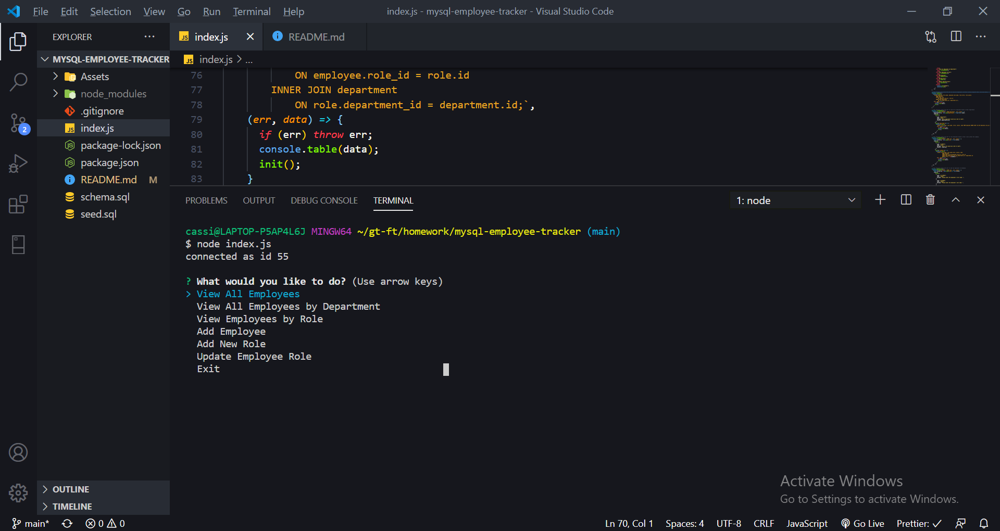
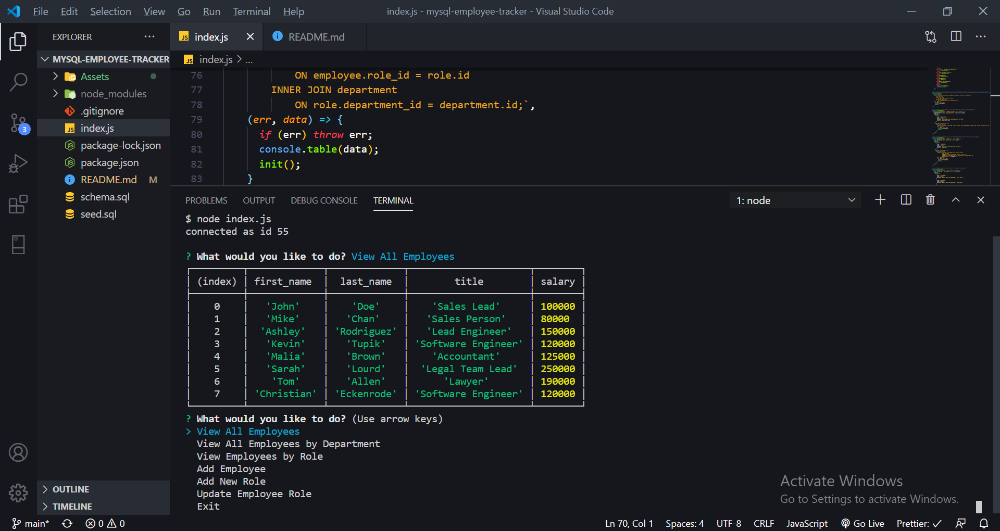
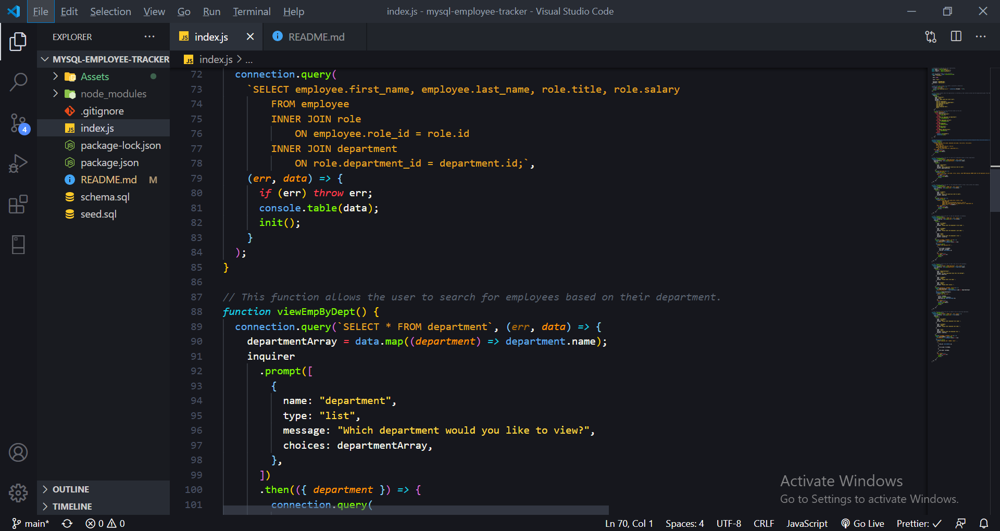

# MySQL Employee Tracker

## Description

The Employee Tracker provies the user with a way to view, add, and remove employees, departments, and roles from their database. The bulk of the application is built using MySQL, to pull from a hard-coded database, along with Inquirer to provide the prompts. The prompts that the user is asked are easy to navigate, to provide a pleasant experience and minimal learning curve.

 ## Installation

 The Employee Tracker is installed by first cloning the repo from [Edibozu](https://github.com/Edibozu/note-taker-ep). Once cloned, it needs to be opened in VS Code and ran by opening the terminal. Run the command ```node index.js```, and the first set of prompts will appear. Depending on how the user answers, the application will do the rest.
<br/><br/>
The image below shows the prompts once the application is first started up
<br/><br/>

<br/><br/><br/>
This shot shows a table on how the information is organized.
<br/><br/>

<br/><br/><br/>
This shot shows the the code incorporates both MySQL queries along with Inquirer prompts.
<br/><br/>

<br/><br/>

## Questions

For any questions, contact me on any of the following links:

Email: edibozu@gmail.com

GitHub Repo: https://github.com/Edibozu/mysql-employee-tracker

LinkedIn: https://www.linkedin.com/in/eduardo-pineda-5595431b6/

## Contributions

This application was aided by my fellow classmates during our after class study sessions. 

## License

MIT License

Copyright (c) [2020] [Eduardo Pineda]

Permission is hereby granted, free of charge, to any person obtaining a copy
of this software and associated documentation files (the "Software"), to deal
in the Software without restriction, including without limitation the rights
to use, copy, modify, merge, publish, distribute, sublicense, and/or sell
copies of the Software, and to permit persons to whom the Software is
furnished to do so, subject to the following conditions:

The above copyright notice and this permission notice shall be included in all
copies or substantial portions of the Software.

THE SOFTWARE IS PROVIDED "AS IS", WITHOUT WARRANTY OF ANY KIND, EXPRESS OR
IMPLIED, INCLUDING BUT NOT LIMITED TO THE WARRANTIES OF MERCHANTABILITY,
FITNESS FOR A PARTICULAR PURPOSE AND NONINFRINGEMENT. IN NO EVENT SHALL THE
AUTHORS OR COPYRIGHT HOLDERS BE LIABLE FOR ANY CLAIM, DAMAGES OR OTHER
LIABILITY, WHETHER IN AN ACTION OF CONTRACT, TORT OR OTHERWISE, ARISING FROM,
OUT OF OR IN CONNECTION WITH THE SOFTWARE OR THE USE OR OTHER DEALINGS IN THE
SOFTWARE.
